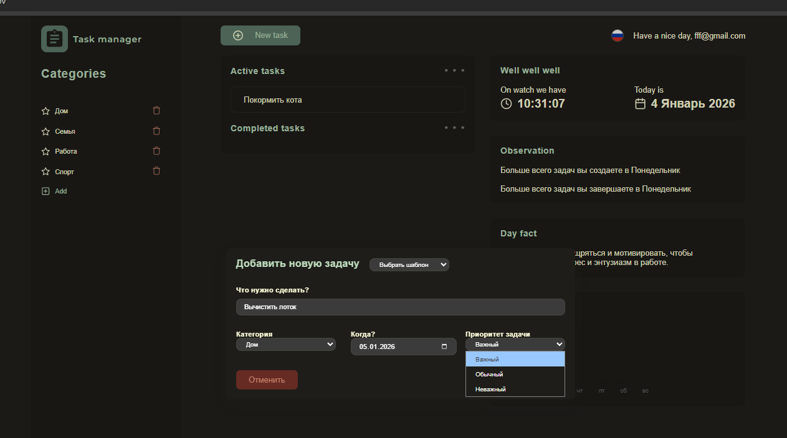
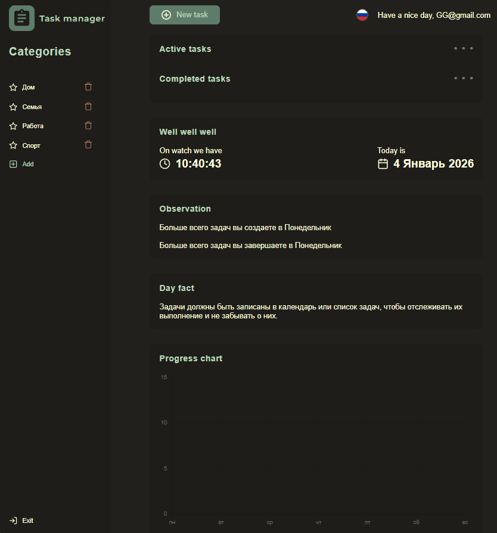

# Кратко о пет проекте
Делался упор на реализацию frontend при помощи React+JS->TS+ReduxToolkit+i18n+MaterialUI  
с использованием Mock Golang server(UDP_04_01_2026: will be refactoring it later)  
Верстка выглядит "грязновато" было не приоритетно (UDP_04_01_2026: will be refactoring it later) 
## Демо интерфейса и features
### Skeleton шаблон во время подкачки данных

### Добавление новой задачи

### Добавление новой задачи с приоритетом

### Отметка о выполенении задачи

### Перевод при помощи i18n

### Форма log in

### Mock регистрация аккаунта

### log in в новый аккаунт

### Чистый профиль нового пользователя
